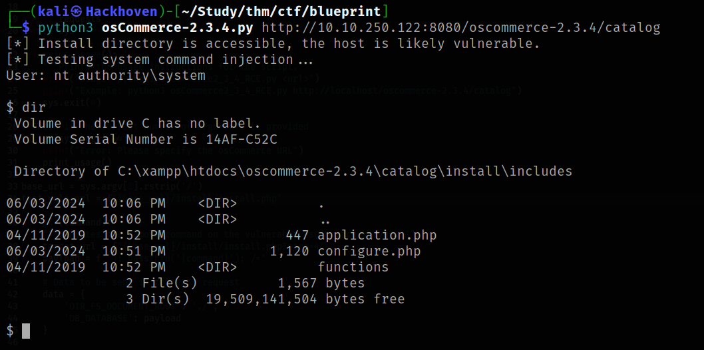

# osCommerce 2.3.4 - Remote Command Execution (RCE)

## Description

This script exploits a remote command execution vulnerability in osCommerce 2.3.4 when the `/install` directory hasn't been removed by the administrator. It leverages the `install.php` finish process by injecting a PHP payload into the `db_database` parameter and reads the system command output from `configure.php`.

**Disclaimer:** This script is for educational purposes only. Use it at your own risk. The author is not responsible for any damage caused by this script. Ensure you have permission before using it on any system.

## Proof of Concept (PoC)



## Usage

1. Clone the repository:  
   ```bash
   git clone https://github.com/Hackhoven/osCommerce-2.3.4-RCE.git
   cd osCommerce-2.3.4-RCE/
   ```
2. Run the script:   `python3 osCommerce2_3_4_RCE.py http://CHANGE-IP/oscommerce-2.3.4/catalog`
Note: You have to change the IP address.

## Credits

This script was originally developed by Bryan Leong. His work laid the foundation for understanding and exploiting this vulnerability in osCommerce 2.3.4. The current modifications and enhancements have been made by @Hackhoven to further demonstrate and expand upon the original concept.


